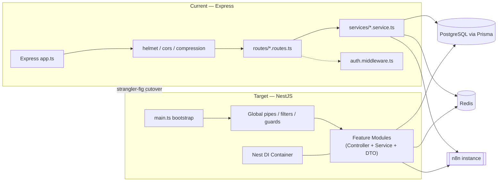
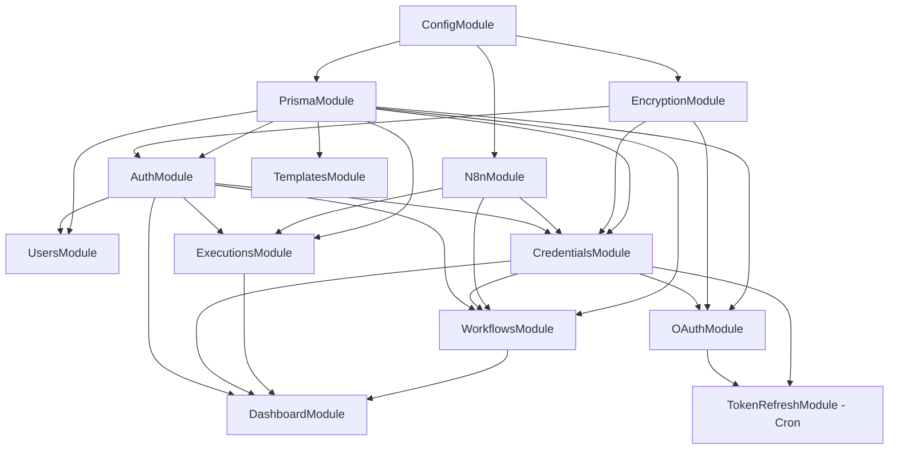
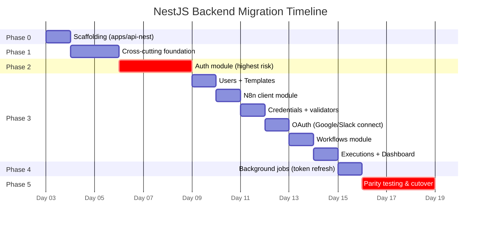
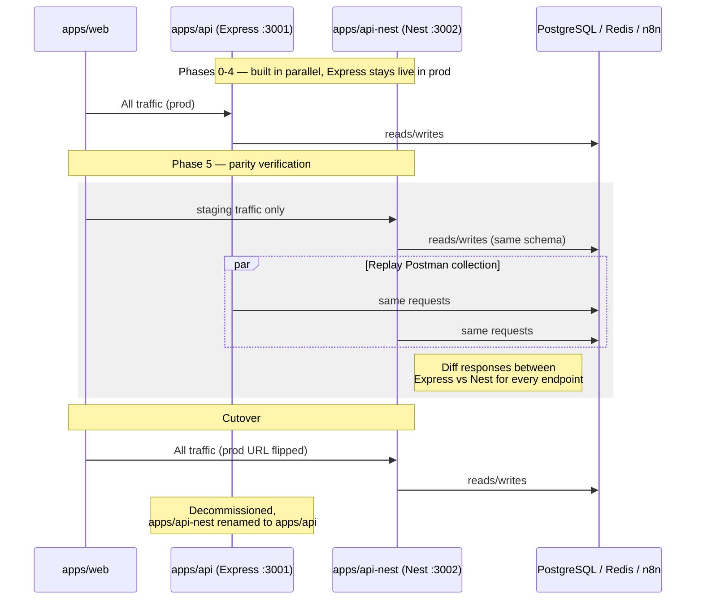

# NestJS Backend Rebuild — Implementation Plan

## Current state (what we're replacing)

`apps/api` is Express 4 + TypeScript (tsx dev, vitest tests), talking to Postgres via `@conduit/database` (Prisma), Redis via ioredis, and an n8n instance via a hand-rolled axios client (`@conduit/n8n-client`). It's a monorepo with `packages/database`, `packages/n8n-client`, `packages/shared` already factored out — that's a big head start since those don't need to change.

Feature surface: JWT auth (access+refresh, passport-jwt) with Google OAuth login, a separate **app-credential** system (Google/Slack/OpenAI creds validated then AES-256-GCM encrypted at rest, synced into n8n as n8n credentials), template catalog, workflow deployment (template → n8n workflow), execution tracking, a dashboard aggregation endpoint, an OAuth token-refresh service (cron-style), audit logging, and standard middleware (helmet, cors, rate-limit, morgan/winston).

This is a well-bounded rewrite — not a redesign. The plan below is a like-for-like port to NestJS's module/DI structure, not a re-architecture, so the DB schema and business logic stay put and the risk stays low.

## Guiding decisions

- **Keep Prisma and the schema unchanged.** `packages/database` gets wrapped in a NestJS `PrismaService`, not replaced. Zero migration risk on the data layer.
- **Strangler-fig cutover, not a big-bang swap.** Run the NestJS app behind the same `/api/v1` contract, route-by-route, verified against the Express app via the existing Postman collection, before decommissioning Express.
- **Preserve the module boundary that already exists in the routes**, and let it drive the NestJS module split: Auth, Users, Templates, Credentials, OAuth, Workflows, Executions, Dashboard, N8n (shared provider), Encryption (shared provider).
- **Platform choice:** stick with `@nestjs/platform-express` (not Fastify) — no reason to introduce a second migration variable. helmet/cors/compression/passport all drop in unchanged.

## Current vs. target architecture

## Target module map

| Express file(s) | NestJS module |
|---|---|
| `routes/auth.routes.ts`, `middleware/auth.middleware.ts` | `AuthModule` — `AuthController`, `AuthService`, `JwtStrategy`/`JwtRefreshStrategy` (Passport), `JwtAuthGuard` |
| `routes/user.routes.ts` | `UsersModule` |
| `routes/template.routes.ts` | `TemplatesModule` |
| `routes/credential.routes.ts`, `services/credentials.service.ts`, `services/credential-validators/*` | `CredentialsModule` — validators become injectable strategy classes behind a `CredentialValidatorRegistry` |
| `routes/oauth.routes.ts`, `controllers/oauth.controller.ts`, `services/oauth/*` | `OAuthModule` (Google, Slack) |
| `routes/workflow.routes.ts`, `services/workflow.service.ts` | `WorkflowsModule` |
| `routes/execution.routes.ts`, `services/execution.service.ts` | `ExecutionsModule` |
| `routes/dashboard.routes.ts`, `services/dashboard.service.ts` | `DashboardModule` |
| `services/n8n.client.ts`, `services/n8n-credential.service.ts`, `packages/n8n-client` | `N8nModule` (global, injectable `N8nClientService`) |
| `services/encryption.service.ts` | `EncryptionModule` (global provider) |
| `services/token-refresh.service.ts` | `TokenRefreshModule` using `@nestjs/schedule` (`@Cron`) instead of an ad hoc script |
| `lib/prisma.ts` | `PrismaModule`/`PrismaService` (global) |
| `lib/logger.ts` (winston) | `nest-winston`, wired as the Nest logger |
| `middleware/errorHandler.ts`, `notFoundHandler.ts` | Global `AllExceptionsFilter` + Nest's built-in 404 |
| `config/index.ts` (zod) | `ConfigModule.forRoot()` with a Zod-backed `validate()` function |

## Module dependency graph

## Phased roadmap

**Phase 0 — Scaffolding (0.5–1 day)**
Add `apps/api-nest` alongside the existing `apps/api` in the monorepo (don't touch the running service yet). `nest new`, wire it to `@conduit/database`, `@conduit/shared`, `@conduit/n8n-client` as workspace deps. Port `config/index.ts`'s zod schema into a Nest `ConfigModule` validator. Get `/api/health` live and a smoke test passing.

**Phase 1 — Cross-cutting foundation (1–2 days)**
`PrismaModule`, `EncryptionModule` (port `encryption.service.ts` verbatim — it's pure crypto, no framework coupling), global `AllExceptionsFilter` mirroring `errorHandler.ts`'s `ApiError` shape (so API error responses are byte-for-byte compatible with what the frontend expects), `ValidationPipe` with zod-backed DTOs (use `nestjs-zod` to reuse the existing zod schemas instead of rewriting everything as `class-validator`), winston logger wired via `nest-winston`, helmet/cors/compression/rate-limit in `main.ts`.

**Phase 2 — Auth (2–3 days)**
Highest risk, do it early. Port `passport-jwt` + `passport-google-oauth20` strategies into Nest's `@nestjs/passport` wrappers, `JwtAuthGuard` as a Nest guard (`@UseGuards`), refresh-token rotation logic from `auth.routes.ts` into `AuthService`. This is the module every other module depends on for `@CurrentUser()` decoration, so lock down its contract (cookie names, token expiry, response shape) and verify against the Postman collection before moving on.

**Phase 3 — Domain modules, in dependency order (4–6 days)**
1. `UsersModule` (small, low risk — validates the pattern)
2. `TemplatesModule` (read-heavy, no external deps)
3. `N8nModule` — port `n8n.client.ts` as an injectable service, typed interfaces carry over almost unchanged
4. `CredentialsModule` + validators (`google.validator.ts`, `openai.validator.ts`, `slack.validator.ts` → a `CredentialValidator` interface with per-provider implementations, registered via a token map for extensibility)
5. `OAuthModule` (Google/Slack app-credential connect flows — distinct from login OAuth)
6. `WorkflowsModule` (depends on N8n + Credentials)
7. `ExecutionsModule` (depends on N8n)
8. `DashboardModule` (aggregates across the above — do last)

**Phase 4 — Background jobs (1 day)**
`token-refresh.service.ts`'s scheduled sweep becomes a `@Cron()` in a `TokenRefreshModule` via `@nestjs/schedule`. If execution polling or n8n sync ever needs real queuing/retries, this is also the natural point to introduce `@nestjs/bullmq` against the existing Redis instance — but only if there's an actual need beyond what the simple sweep does today; don't add BullMQ speculatively.

**Phase 5 — Parity testing & cutover (2–3 days)**
Run both `apps/api` (Express) and `apps/api-nest` (Nest) side by side, then cut over.

## Cutover sequence (strangler-fig)

## Testing strategy

Nest's DI makes service-level unit tests easier than the current Express setup (no more manually reaching into modules to mock `prisma`). Migrate `vitest` tests module-by-module alongside each phase — don't leave testing for the end. Use `@nestjs/testing`'s `Test.createTestingModule` with a mocked `PrismaService` for unit tests, and keep `supertest` for e2e against a real test DB (Nest has first-class supertest e2e support via `@nestjs/testing` + `INestApplication`).

## Risks & mitigations

- **Auth contract drift** (cookie flags, token expiry semantics) breaking `apps/web` silently → freeze the contract in Phase 2, verify with the frontend's actual auth flow before Phase 3 starts.
- **Credential encryption format mismatch** → `encryption.service.ts` port must be byte-identical (same algorithm/IV/authTag handling); write a round-trip test against real encrypted rows from the current DB before touching `CredentialsModule`.
- **n8n API drift during migration** → `N8nModule` should be a near-verbatim port of `n8n.client.ts`; don't refactor its error handling in the same pass as the framework migration.
- **Big-bang temptation** → resist rewriting business logic "while we're in there." This is a framework port; scope creep here is what turns a 2-week job into a 2-month one.

## Rough timeline

10–15 working days for one engineer end-to-end (scaffolding → parity cutover), assuming no schema changes and no new features land mid-migration.
